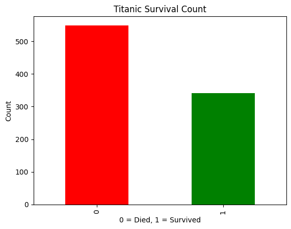
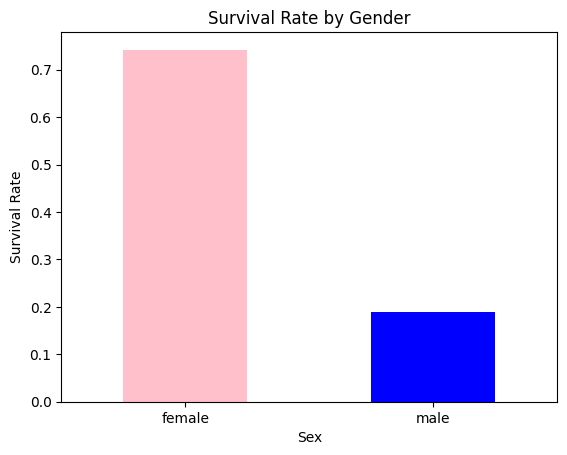
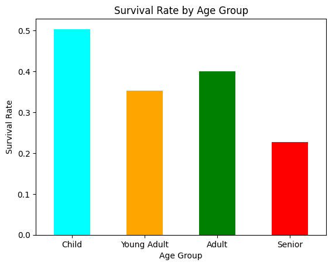

# Titanic-Survival-Prediction

# 🚢 Titanic Survival Analysis & Prediction

End-to-end Data Science project on the Titanic dataset — from raw data exploration to a Machine Learning model with **79% accuracy.**

---

## 📌 What This Project Covers

- Exploratory Data Analysis (EDA)
- Data Cleaning & Missing Value Treatment
- Feature Engineering
- Machine Learning — Decision Tree Classifier
- Feature Importance Analysis

---

## 🔍 Key Findings

### 1. Overall Survival Count
Out of 891 passengers — **549 died** and **342 survived** (38% survival rate)



---

### 2. Did Gender Affect Survival?
Females survived at **74%** vs males at only **19%** — gender was the single biggest survival factor.



---

### 3. Did Passenger Class Matter?
1st class survived at **63%** vs 3rd class at only **24%** — money bought survival.

---

### 4. Did Family Size Matter?
Solo travellers had only **30% survival** while medium families (2-4) had the best rate at **55-72%.** Large families of 8+ had **0% survival.**

---

## 🤖 Model Performance

| Model | Feature Added | Accuracy |
|-------|--------------|----------|
| Decision Tree (baseline) | No tuning | 63% |
| Decision Tree (max_depth=4) | Depth control | 71% |
| Decision Tree (final) | Added Gender feature | **79%** |

---

## 🧠 Feature Importance
The model confirmed what EDA found — gender and class were the two most critical survival factors.



| Feature | Importance |
|---------|------------|
| Sex | 58% |
| Pclass | 20% |
| Fare | 8.7% |
| Age | 7.6% |
| FamilySize | 5.2% |

---

## 🛠️ Tech Stack

- Python 3.13
- Pandas, NumPy
- Matplotlib
- Scikit-learn

---

## 📁 Project Structure

```
titanic-analysis/
│
├── python.ipynb          # Main notebook with full analysis
├── images/               # Visualization screenshots
│   ├── survival_count.png
│   ├── gender_survival.png
│   └── feature_importance.png
└── README.md
```

---

## 🚀 How to Run

```bash
# Clone the repo
git clone https://github.com/nupoork8/titanic-analysis

# Install dependencies
pip install pandas numpy matplotlib scikit-learn

# Open the notebook
jupyter notebook python.ipynb
```

---
